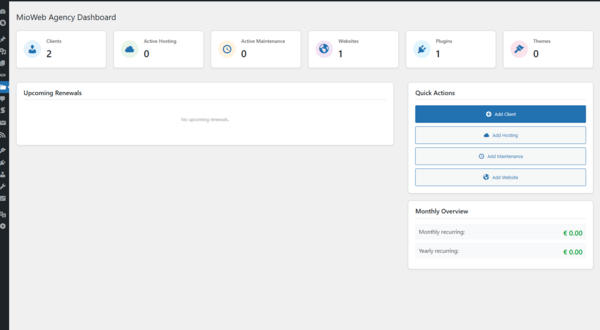
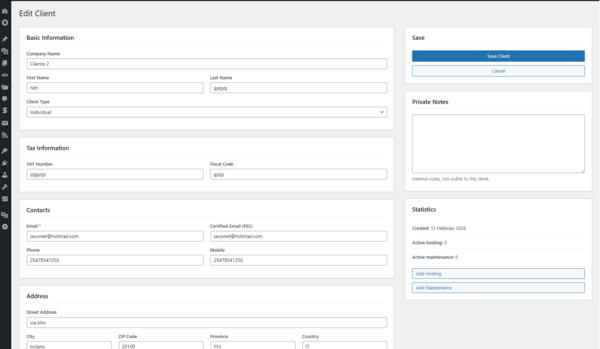
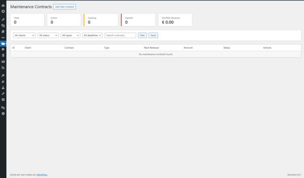
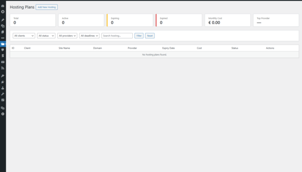

🚀 # MioWeb Agency Management CRM

**Contributors:** Sergio Cornacchione  
**Tags:** agency crm, client management, hosting tracking, maintenance contracts, theme maintenance  
**Requires at least:** 6.0 
**Tested up to:** 6.9  
**Stable tag:** 1.0.0  
**License:** GPL v2 or later  
**License URI:** https://www.gnu.org/licenses/gpl-2.0.html 

MioWeb Agency Management è il CRM definitivo progettato specificamente per web agency e freelance che lavorano con WordPress. Gestisci clienti, piani hosting, contratti di manutenzione e il tuo portfolio progetti in un unico hub centralizzato.

🔥 ## Perché MioWeb?
Gestire un'agenzia web significa destreggiarsi tra decine di scadenze, credenziali smarrite e contratti ricorrenti. Questo plugin elimina il caos dei fogli Excel, portando tutta la gestione operativa direttamente dentro la tua bacheca WordPress.

🌟 ## Funzionalità principali
- ✅ Gestione Clienti (CRM): Database completo con dati fiscali, contatti e note.

- ✅ Tracking Hosting: Monitora provider, costi, scadenze e credenziali di accesso.

- ✅ Contratti di Manutenzione: Gestisci i canoni ricorrenti e ricevi avvisi sulle scadenze.

- ✅ Portfolio Tecnico: Catalogo di Siti Web, Plugin e Temi sviluppati (Custom Post Types).

- ✅ Dashboard Intelligente: Statistiche in tempo reale e alert per i rinnovi imminenti.

- ✅ Export CSV: Esporta i tuoi dati per reportistica o fatturazione esterna.

📸 ## Screenshot
1. Dashboard Panoramica
Visualizza immediatamente lo stato della tua agenzia e le scadenze dei prossimi 30 giorni.

2. Gestione Clienti e CRM
L'elenco completo dei tuoi contatti business con filtri avanzati.

3. Dettaglio Hosting e Scadenze
Non perdere mai più un rinnovo grazie al tracking visivo dei piani hosting.custom sviluppati.

4. Repository Progetti e Plugin
Organizza i siti web realizzati e tieni traccia dei plugin.

🛠 ## Installazione
Clona il repository nella cartella dei plugin di WordPress:

Bash
git clone https://github.com/tuo-username/mio-web-agency.git
Attiva il plugin dalla dashboard di WordPress.

Troverai il nuovo menu "MioWeb" nella barra laterale sinistra.

💻 ## Sviluppo e Standard
Il plugin è stato sviluppato seguendo i WordPress Coding Standards per garantire sicurezza e performance:

Utilizzo di wpdb::prepare per ogni query SQL.

Sanitizzazione e validazione di tutti gli input (zero warning nel Plugin Check).

Supporto completo per le traduzioni.

🤝 ## Contribuire
Le pull request sono benvenute! Se vuoi proporre modifiche o nuove funzionalità:

Apri una Issue per discutere il cambiamento che vorresti apportare.

Fai un Fork del progetto.

Crea un branch per la tua feature (git checkout -b feature/AmazingFeature).

Fai il Commit dei cambiamenti (git commit -m 'Add some AmazingFeature').

Fai il Push sul branch (git push origin feature/AmazingFeature).

Apri una Pull Request.

📄 ## Licenza
Questo progetto è distribuito sotto licenza GPLv2 o successiva. Consulta il file LICENSE per ulteriori dettagli.

📧 ## Supporto
Sviluppato con ❤️ da Seconet.it Per domande o supporto commerciale, contattaci tramite il nostro sito web.
